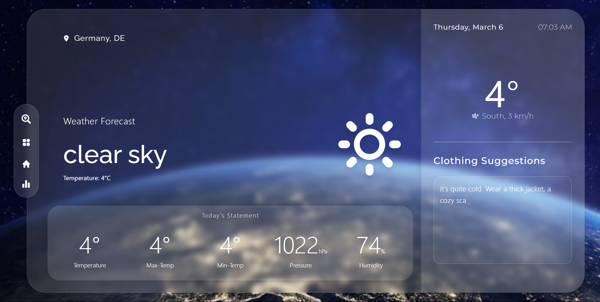

# CloudSense ☂️

CloudSense is a weather forecasting web application that provides real-time weather data for any location. It displays temperature, humidity, pressure, wind speed, and min/max temperatures while also suggesting clothing based on the weather.

## 🚀 Features

- 🌍 Search for weather in any location.
- 📊 Displays temperature, humidity, min/max temperature, wind speed, and pressure.
- 👕 Suggests clothing based on weather conditions.
- 🎨 Clean and responsive UI built with React and Tailwind CSS.
- ⚡ Fast performance with Vite.

## 🛠️ Tech Stack

- **Frontend:** React, Tailwind CSS
- **Build Tool:** Vite
- **State Management:** Context API
- **Custom Hooks:** useTypingEffect for animations

## 📁 Project Structure

```
cloudsense/
├─ public/                   # Background and weather images
│  ├─ UI/                    # Screenshots of the UI
├─ src/                      # Main source files
│  ├─ components/            # UI components (Search, WeatherCard, etc.)
│  ├─ context/               # Context API for data handling
│  ├─ hook/                  # Custom hooks (Typing effect)
│  ├─ assets/                # Icons and assets
│  ├─ App.jsx                # Main app file
│  ├─ main.jsx               # Entry point
├─ index.html                # Root HTML file
├─ tailwind.config.js        # Tailwind CSS configuration
├─ vite.config.js            # Vite configuration
├─ package.json              # Dependencies and scripts
└─ README.md                 # Project documentation
```

## 🛀 Installation

1. **Clone the repository:**
   ```sh
   git clone https://github.com/your-username/cloudsense.git
   ```
2. **Navigate to the project directory:**
   ```sh
   cd cloudsense
   ```
3. **Install dependencies:**
   ```sh
   npm install
   ```
4. **Start the development server:**
   ```sh
   npm run dev
   ```

## 🖼️ Screenshots

### 🌍 Home Page



### 🔍 Search Feature


## 🚀 Deployment

You can deploy CloudSense using platforms like **Vercel** or **Netlify**.

## 📚 License

This project is licensed under the **MIT License**.

---

Happy coding! 😊🌤️
